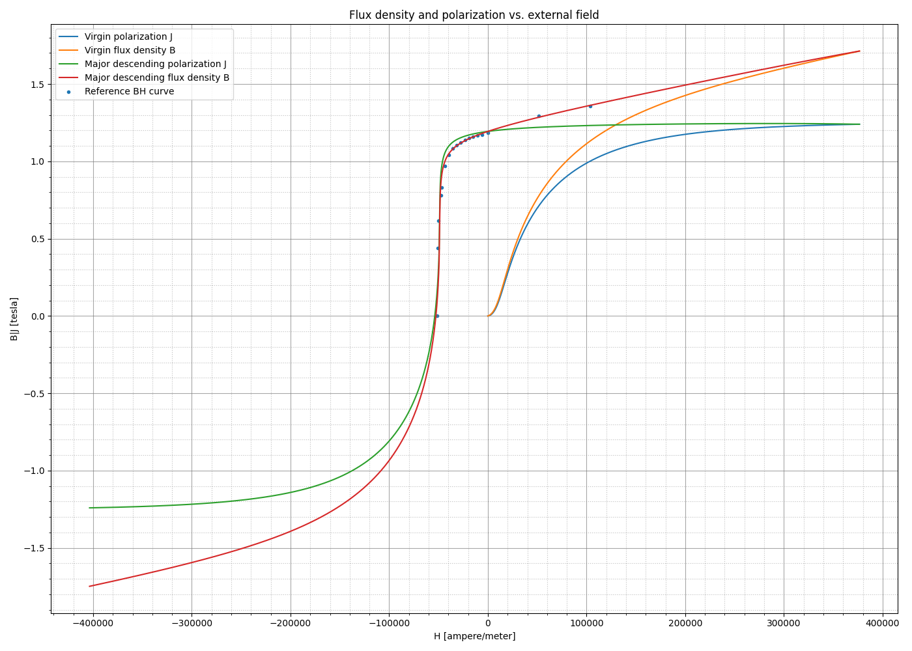
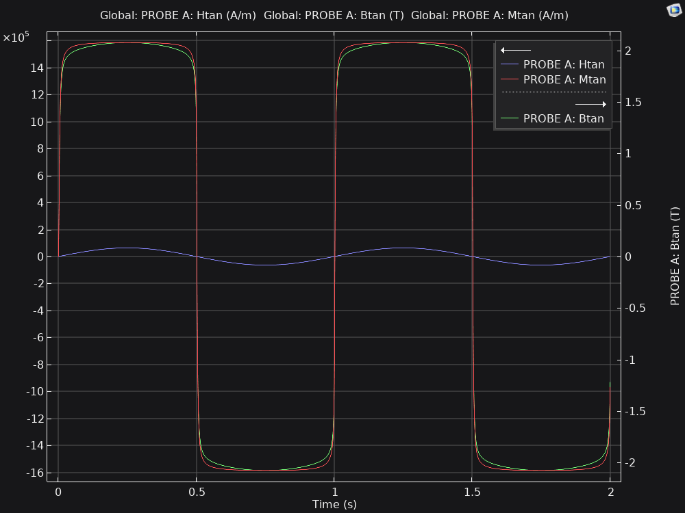
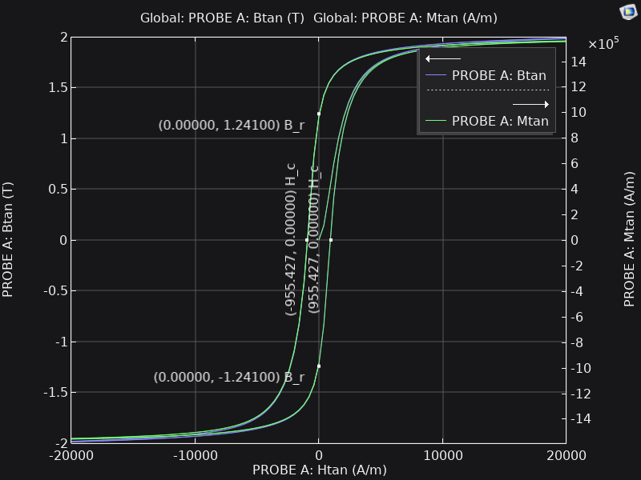

# jafit

Jiles-Atherton system identification tool: Given a BH curve, finds the Jiles-Atherton model coefficients.



## Usage

The tool accepts a tab-separated file encoding the demagnetization BH curve as a command line argument,
where the first column contains the magnetic field strength H in ampere/meter,
and the second column contains the magnetic flux density B in tesla.
The rows should be ordered by increasing H.
The first row may or may not be the header row.

Ideally, the reference BH curve should cover the entire range from negative to positive (near-)saturation;
providing only the third quadrant is not sufficient for full system identification.

Install the package before using it:

```shell
pip install .
```

Derive parameters for a given BH curve as shown below.
Optionally, you can provide the initial guess for (some of) the coefficients like `c_r=0.07`, etc.
Be sure to launch the tool from a dedicated directory because it may generate a lot of intermediate output files.
All existing outputs in the current working directory are removed at startup.

```shell
jafit data/bh-lng37.tab
```

Solve the JA equation with the given coefficients:

```shell
jafit c_r=0.1 M_s=1e6 a=560 k_p=1200 alpha=0.0007
```

Add `H_max=30e3` to manually limit the maximum H-field strength to 30 kA/m instead of relying on heuristics.

## Development

To run tests locally, simply say `nox`.

If you want to run PyTest only, you may want to `export NUMBA_DISABLE_JIT=1` beforehand, or uninstall Numba.

To profile, go like: `python3 -m cProfile -o out.prof -m jafit ../data/bh-lng37.tab`.
Then you can use `flameprof` to visualize the collected data.

## Validation

There is a COMSOL model in the `validation` directory that contains a bored steel cylinder with a copper wire passing along its axis. The wire carries a 1 Hz magnetizing current whose amplitude is chosen to be just high enough to push the cylinder material into saturation, while the frequency is chosen to be low to avoid eddy currents. The setup is used to obtain the BH curve and ascertain that it matches the predictions made by the tool.

To make the prediction, run the tool specifying the JA model coefficients copied from the material properties assigned to the cylinder in the COMSOL model:


```shell
jafit c_r=0.1 M_s=1.6e6 a=560 k_p=1200 alpha=0.0007
```

Note the predicted $H_c$, $B_r$, and $BH_\text{max}$ and compare them against the values seen in the COMSOL model.




