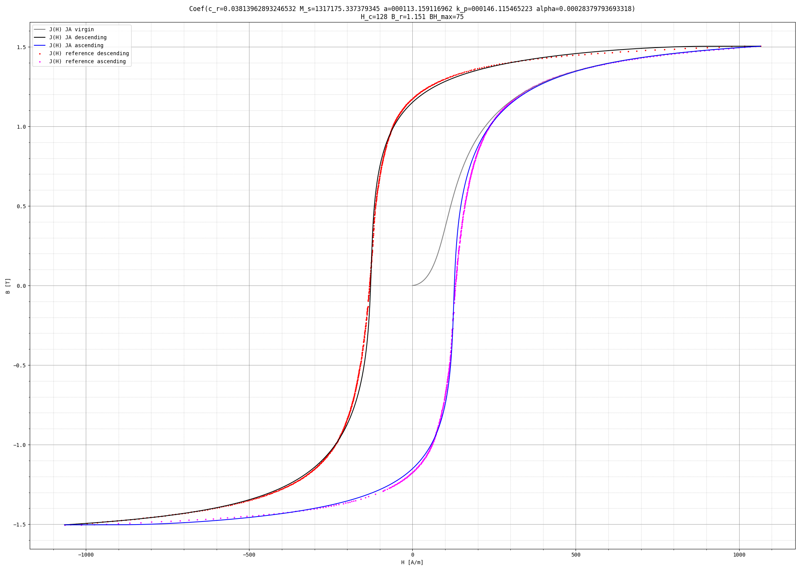
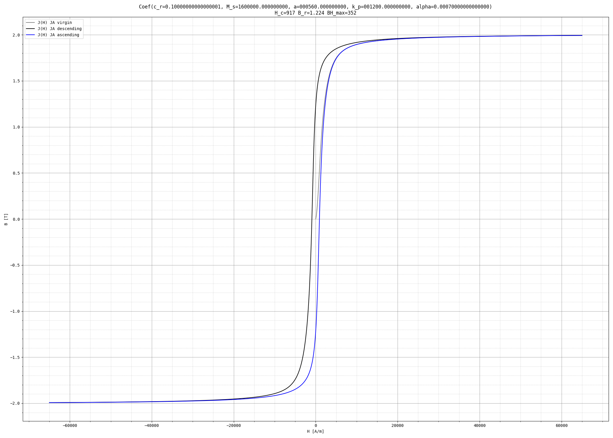
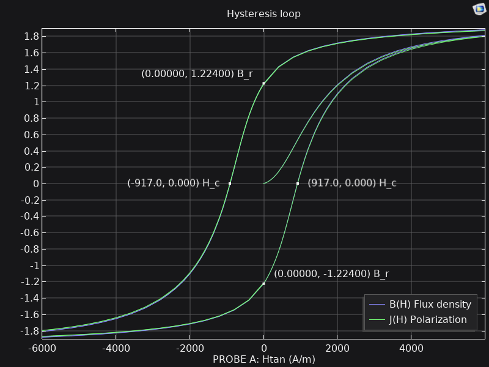
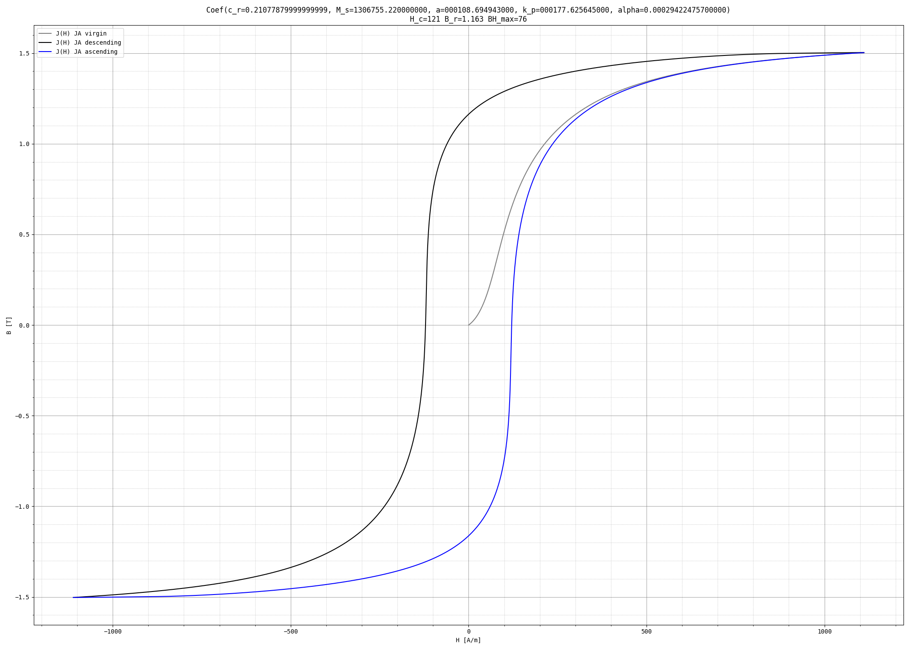
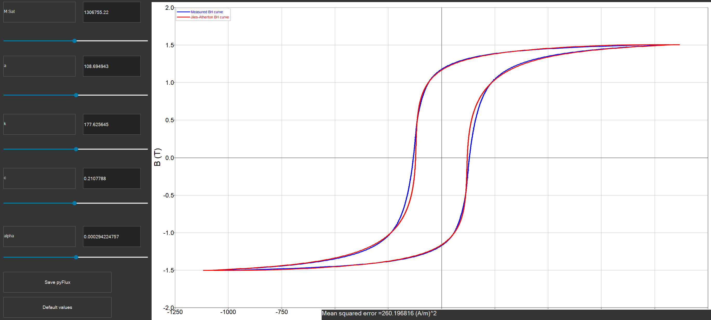

# jafit

[](https://forum.zubax.com)

Jiles-Atherton system identification tool: Given a hysteresis loop, finds the Jiles-Atherton model coefficients.
Supports several JA model definitions.



## Usage

### Install the tool

```shell
git clone https://github.com/Zubax/jafit
cd jafit
pip install .
```

The tool works on GNU/Linux and Windows. Probably also on macOS, but YMMV.

### Solve the JA equation

The tool will plot the curves and export table files containing the data points.

```shell
# Coefficients from the default COMSOL Jiles-Atherton material model:
jafit model=venk  c_r=0.1 M_s=1.6e6 a=560 k_p=1200 alpha=0.0007

# Coefficients from the Altair Flux example B(H) curve:
jafit model=venk  H_amp_max=1111  c_r=0.2107788 M_s=1306755.22 a=108.694943 k_p=177.625645 alpha=0.000294224757

# From "Modeling of permanent magnets: Interpretation of parameters obtained from the Jiles–Atherton hysteresis model":
jafit model=orig  H_amp_min=4774648 H_amp_max=4774648  c_r=0.885 M_s=1080000 a=1107718.3824 k_p=702271.17275 alpha=3.168
```

If the H amplitude is set manually and is insufficient to reach saturation,
the resulting hysteresis loop will be a minor loop.

### Find JA coefficients for a given reference B(H) curve

The fitting problem may take multiple hours to solve, depending on the curve shape and the performance of your computer.
Intermediate results and logs will be stored in the current working directory,
so it may be a good idea to create a dedicated directory for this purpose.

```shell
# Fit the example curve from Altair Flux:
jafit model=venk ref="data/B(H).Altair_Flux.Example.csv" interpolate=300

# Find coefficients for isotropic AlNiCo 5:
jafit model=venk ref="data/B(H).Jesenik.AlNiCo.tab"
```

Output symbol legend per function evaluation:
💚 -- best match so far; ❌ -- no solution (convergence failure); 🔵 -- solution exists but is not the best.
Use `quiet=1` to reduce the verbosity.

The input reference curve file must contain two columns: H \[A/m\] and B \[T\], either tab- or comma-separated.
The first row may or may not be the header row.

The reference curve may be either the entire hysteresis loop, or any part of it;
e.g., only a part of the descending branch.
If a full loop is provided, then that loop doesn't need to be the major loop;
the tool will simply use the H amplitude seen in the reference loop for solving the JA equation.

Option `interpolate=N`, where N is a positive integer, can be used to interpolate the reference curve
with N equidistant sample points distributed along its length. Note that this is not the same as sampling the curve
on a regular H-axis grid; the difference is that the used method ensures consistent Euclidean distances between
the sample points. This is useful with irregularly sampled curves, but may cause adverse effects if the reference
curves contain large gaps, as the interpolation error within the gaps may be large.

If interpolation is not used (it is not by default), then the optimizer will naturally assign higher importance
to the regions of the curve with higher density of sample points. This may be leveraged to great advantage
if the reference curve is pre-processed to leave out the regions that are less important for the fitting.

If the reference curve is only a part of the hysteresis loop,
then the tool will use simple heuristics to guess the reasonable H amplitude for solving the JA equation,
assuming that the loop is the major loop (i.e., it reaches saturation).
In this case, it is recommended to specify `H_amp_min` and/or `H_amp_max` explicitly instead of relying on heuristics.

`H_amp_min` specifies the minimum H magnitude that must be reached before switching the H sweep direction,
and `H_amp_max` is the maximum H magnitude that the solver is allowed to use; the solver will flip the H sweep
direction somewhere between these two values as soon as the material reaches saturation ($\chi^\prime$ becomes small).

If the loop is known to be the major loop, then it is occasionally useful to manually extend `H_amp_max` a little
to ensure that the material reaches deep saturation, so that the optimizer converges to a good $M_s$ value faster.

Optionally, you can provide the initial guess for (some of) the coefficients: `c_r`, `M_s`, `a`, `k_p`, `alpha`.

The optimization is done in multiple stages, with global search preceding local refinement.
The tool can be instructed to skip N first stages by setting `stage=N`. See the code for details.

The tool relies on a robust implicit solver to work around stiffness that arises with certain coefficient combinations
during the optimization process. While ultra-high stiffness may be considered unphysical as it may indicate an
unrealistically high magnetic susceptibility, being able to solve such cases is useful as it improves the smoothness
of the optimization landscape, which in turn helps the optimizer converge faster and reduces the chances of
getting stuck in local minima.

### Helpful tips

For fetching the (approximate) data points from a third-party plot,
such as from a published paper or a material datasheet,
consider using [`trace_image.py`](https://gist.github.com/pavel-kirienko/0fcd509cd1d7c6dc2651981510badb99).

For the benefit of all mankind, please only use SI units. To convert data from a non-SI source:

- $1 \ \text{oersted} \approx 79.57747 \frac{\text{A}}{\text{m}}$
- $1 \ \frac{\text{emu}}{\text{cm}^3} = 10^3 \frac{\text{A}}{\text{m}}$

For more, refer to `papers/magnetic_units.pdf`.

## Validation

### Against COMSOL Multiphysics

There is a COMSOL model in the `validation` directory that contains a bored steel cylinder with a copper wire passing
along its axis.

If $B = \mu_0 (H_i + M)$ and $H_i = H - H_d$, where $H_i$ is the internal field and
$H_d = M N_d$ is the demagnetizing field with the demagnetizing factor $N_d$,
then $B = \mu_0 (H - N_d M + M)$.
Since $N_d = 0$ in the absence of free poles, the validation is performed using a loop-shaped magnet
with a magnetization wire passing through the center, which ensures $B = \mu_0 (H + M)$.

The wire carries AC magnetizing current whose amplitude is chosen to be just high enough to push the
cylinder material into saturation, while the frequency is chosen to be low to avoid eddy currents
and small-time-scale coercivity effects.
The setup is used to obtain the J(H) curve and ascertain that it matches the predictions made by the tool.


To make the prediction, run the tool specifying the JA model coefficients copied from the material properties
assigned to the cylinder in the COMSOL model,
note the shape of the curve and the predicted $H_c$, $B_r$, and $BH_\text{max}$,
and compare them against the COMSOL simulation results.

#### Specimen A: default Jiles-Atherton material

Note that we're using the same H-field amplitude as in the COMSOL model.

```shell
jafit model=venk H_amp_max=65e3 c_r=0.1 M_s=1.6e6 a=560 k_p=1200 alpha=0.0007
```



#### Specimen B: LNGT72 approximation

```shell
jafit model=venk c_r=0.00000098783341818 M_s=0931849.980906066 a=025958.529588940 k_p=147381.227474120 alpha=0.17527880356890363 H_amp_min=1e6
```


### Against Altair Flux

The following invocation results in a curve matching the example material from Altair Flux.

```shell
jafit model=venk  H_amp_max=1111  c_r=0.2107788 M_s=1306755.22 a=108.694943 k_p=177.625645 alpha=0.000294224757
```



## Development

To run verification locally, simply say `nox`.

If you want to run PyTest only, you may want to `export NUMBA_DISABLE_JIT=1` beforehand, or uninstall Numba.

To profile, go like: `python3 -m cProfile -o out.prof -m jafit ../data/bh-lng37.tab`.
Then you can use `flameprof` to visualize the collected data.

To evaluate the optimizer behaviors quickly, run the script in fast mode with `fast=1`.
This may render the results inaccurate, but it will be much faster.
